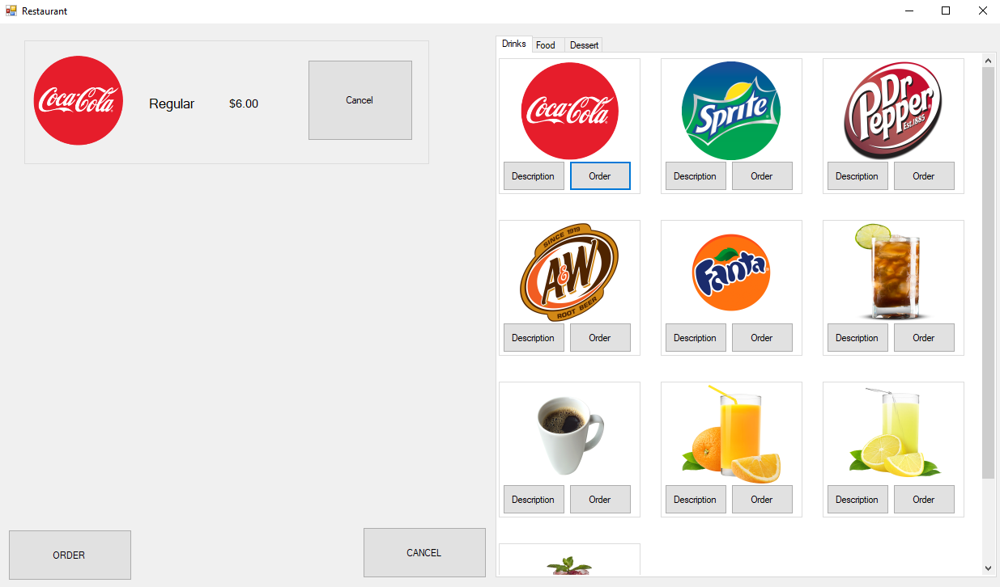
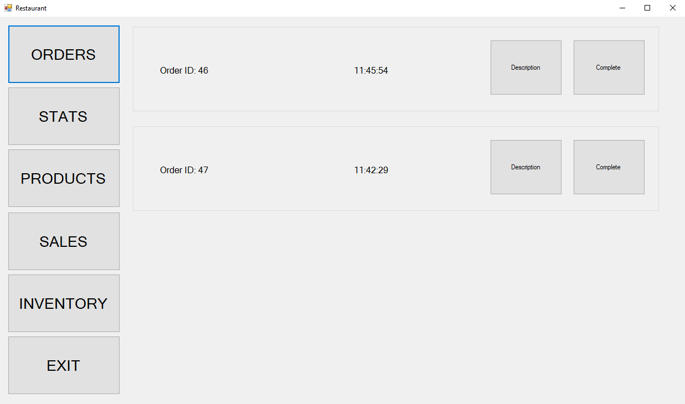
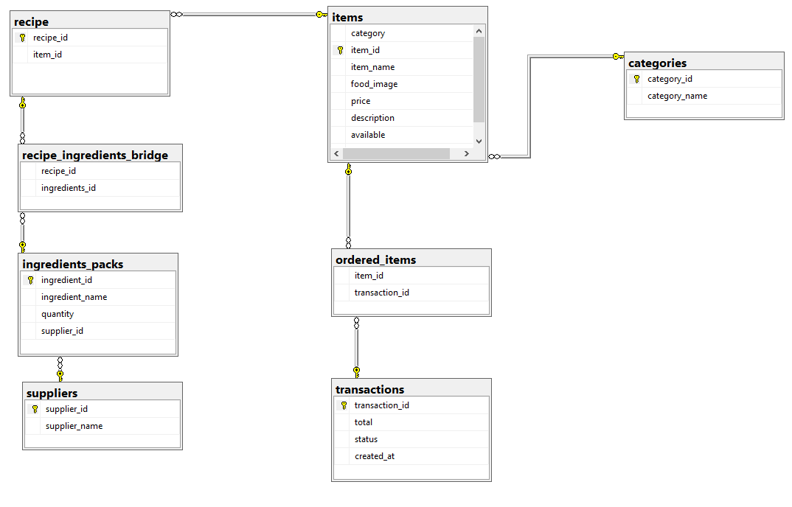

# POS
Point of Sale
The present project is a point of sale made both for fun and to practice basic programming + database/SQL. It features a simulated restaurant PoS made with .NET library, C# and SQL Server. The program is divided mainly in two parts: The customer menu and the Employee menu. 

# Customer Side
The simplest side of this project. It basically consists of two main options: Order and Pay (not implemented). The order option shows the three available menus which are drinks, meals and deserts. Once the client has chosen his items, he can proceed on ordering which will send the DB the transaction.

  

# Employee Side
A more interesting side than customer. This side has a couple of features. 
* First: Orders shows the current live orders with their running time and two buttons. Description shows what the order contains while complete marks the order as completed in the DB and stores the history or the ordered items.
* Second: Stats shows the most ordered items with basic graphs
* Third: Products has buttons per item in the menu, in which, youre available to mark as "out of stock" and updates accordingly in the DB. It also picks up the unavailable from the DB, of course.
* Fourth: Sales lets the user set up two dates and the program will get the sales inbetween said dates. This way the user can see how many orders were made during a lapse of time.
* Fifth: Inventory allows the user to see which ingredients are available at the time and which ones are running low.

  

# The Data Base 
The following is a small dragram that show show the database is structered:

  

NOTE: Remember to run the SQL server script to create the database.
